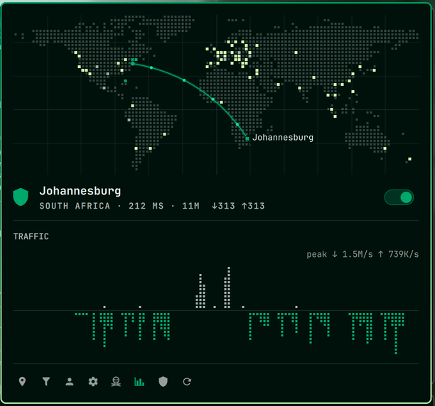

# Aegis

AdGuard VPN in the Omarchy bar. A dot-matrix world map shows where your
traffic exits, with a live arc from your location to the exit city. Pick a
location, it connects. That is the whole interface.



## Highlights

- One-click locations, sorted by ping, with favorites pinned at the top
- Map with an animated link from your real location to the exit city
- Hero switch turns the VPN off, or back on to your last location
- Bar icon lights up when connected; optional country code or live rates
- Site exclusions (general or selective) and account state in the same panel
- Settings: TUN or SOCKS mode (with host, port and auth), protocol, post-quantum,
  DNS upstream and system DNS, all through the CLI's own config
- Reconnects at login if the VPN was on when the session ended, crashes included
- Kill switch: closes the apps you pick (suggested from what is running) if the tunnel drops, and tells you
- Exclusions can be paused and resumed without retyping them
- Hover the map: the nearest city lights up with its name, click to connect
- The row under your cursor rings its city on the map
- Kill switch has its own tab (skull in the footer, filled and lit while armed)
- Daily CLI update check with a one-click update
- Fully keyboard driven

## Install

```bash
omarchy plugin add https://github.com/nimbleaininja/aegis.git --enable
```

Or by hand: copy this folder to `~/.config/omarchy/plugins/io.github.nimbleaininja.aegis/`,
then `omarchy plugin enable io.github.nimbleaininja.aegis --section right`.

## Requirements

- `adguardvpn-cli` (the official AdGuard VPN CLI), logged in
- A sudoers rule so the CLI can start its tunnel without a password prompt.
  The CLI runs `sudo env HOME=… XDG_DATA_HOME=… DISPLAY=… DBUS_SESSION_BUS_ADDRESS=… /opt/adguardvpn_cli/adguardvpn-cli …`,
  so the rule must match that command. Colons inside values have to be escaped:

  ```
  # /etc/sudoers.d/adguardvpn-cli  (mode 0440, check with: visudo -cf <file>)
  hydrox ALL=(root) NOPASSWD: /usr/bin/env HOME=/home/hydrox XDG_DATA_HOME=/home/hydrox/.local/share DISPLAY=\:[0-9] DBUS_SESSION_BUS_ADDRESS=unix\:path=/run/user/1000/bus /opt/adguardvpn_cli/adguardvpn-cli *
  ```

  When the rule is missing or broken the panel shows “sudo needs a password”.
- `python3` (standard library only), `curl` for the one-time location lookup

## Keyboard

| Key | Action |
|---|---|
| `j` / `k`, arrows | move the cursor |
| `Enter` / `Space` | connect to the row, or flip the switch |
| any letter, `/` | search locations |
| `f` | favorite the row under the cursor |
| `t` | toggle the VPN |
| `d` | disconnect |
| `e` | exclusions |
| `a` | account |
| `s` | settings |
| `K` (Shift+k) | kill switch tab (plain `k` is cursor-up) |
| `h` / `l` | switch chips (mode, protocol) in settings |
| `p` | pause or resume the exclusion under the cursor |
| `x` | remove the exclusion under the cursor |
| `Tab` (in the kill-switch field) | add the highlighted running app |
| `r` | refresh |
| `Esc` | back, then close |
| `Tab` | next bar panel |

Bar icon: left click opens the panel, right click toggles the VPN, middle click refreshes.

## Shell IPC

```bash
omarchy-shell io.github.nimbleaininja.aegis toggle          # open / close the panel
omarchy-shell io.github.nimbleaininja.aegis connect "Tokyo"  # any city from the list
omarchy-shell io.github.nimbleaininja.aegis down
omarchy-shell io.github.nimbleaininja.aegis toggleVpn
omarchy-shell io.github.nimbleaininja.aegis status           # JSON
omarchy-shell io.github.nimbleaininja.aegis barMode rate     # icon | iso | rate
omarchy-shell io.github.nimbleaininja.aegis view exclusions  # list | exclusions | account | settings | killswitch
```

## Configure

Settings live inline on the widget's entry in `~/.config/omarchy/shell.json`:

```json
{ "id": "io.github.nimbleaininja.aegis", "barMode": "icon", "refreshIntervalSec": 30,
  "favorites": ["US|New York"], "lastLocation": "New York" }
```

| Key | Default | Meaning |
|---|---|---|
| `barMode` | `icon` | `icon`, `iso` (country code), or `rate` (live down/up). Vertical bars always show the icon |
| `refreshIntervalSec` | `30` | status poll while the panel is open (doubled while closed) |
| `favorites` | `[]` | `ISO|City` keys, managed with `f` or the star |
| `lastLocation` | `""` | what the switch reconnects to |
| `autoConnect` | `true` | reconnect at login when `wasConnected` is still set |
| `wasConnected` | internal | set while connected, cleared only by a disconnect or logout you make; survives crashes and reboots |
| `killSwitch` | `false` | close `killApps` when the tunnel drops unexpectedly |
| `killApps` | `""` | comma separated process names, each killed with `pkill -x`; pick them from the suggestions of running processes |
| `pausedExclusions` | internal | `{general: [], selective: []}` domains you paused; they are removed from the CLI list and re-added on resume |
| `lastUpdateCheck` | internal | epoch seconds of the last `check-update`; checked again after 24 h |

Connection settings (mode, protocol, post-quantum, DNS, SOCKS) are not stored
by Aegis: they are read from and written to the CLI with `adguardvpn-cli config`.
Changes to mode, protocol, post-quantum or DNS apply on the next connect.

## Privacy

Everything runs locally against `adguardvpn-cli`. The only outbound request the
plugin itself makes is one lookup to `https://ipinfo.io/json`, made while the
VPN is disconnected, to place your home marker. The result is cached in
`~/.cache/io.github.nimbleaininja.aegis/home.json` and refreshed only when your
default gateway changes or after 24 hours. Until a lookup succeeds, the marker
falls back to a rough position derived from your time zone.

## Development

```bash
tests/run                    # manifest, python helper, node models, headless QML, lint
omarchy plugin validate .
```

`agvpn.py` wraps the CLI and prints one JSON document per call (`snapshot`,
`locations`, `connect <name>`, `disconnect`, `account`, `logout`,
`exclusions …`, `config show|set <key> <value>`, `update-check`, `kill <name…>`,
`home`). `Model.js` and `Link.js` are pure ES5 shared by QML
and the node tests. Set `AEGIS_CLI` to point the helper at a fake CLI.

Map data: see `assets/NOTICE.md`.

## License

MIT
